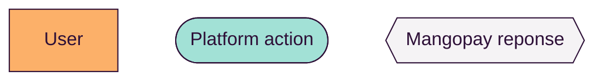
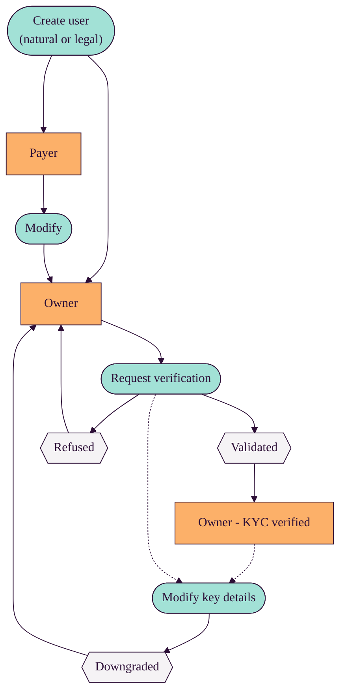

A Mangopay user (natural or legal) can pass through different stages during its existence. Mangopay's system is designed to be flexible while maintaining compliance with regulations in force.  

The diagram below gives an overview of the user life cycle.

### Legend

### Diagram

<Note>  
**Note - User life cycle depends on platform's business model** 
  
The journey and final state of a user on your platform depends on your business model and the actions that the user will want to take. Natural, Owner, and Owner - Verified are all good final states for users depending on their needs.  
</Note>  

<Warning>  
**Caution - All users can be blocked at any time** 
  
Mangopay may block a user at any time for reasons of risk management. Blocks prevent a user from making pay-ins and/or payouts.  
If a user is blocked, there may be steps you can take to have them unblocked. For more information, see the Blocked users article.  
</Warning>  

## Related articles  

<Card title="Article" href="/concepts/users/introduction-types">Introduction and user types</Card>  

<Card title="Article">Hook notifications</Card>