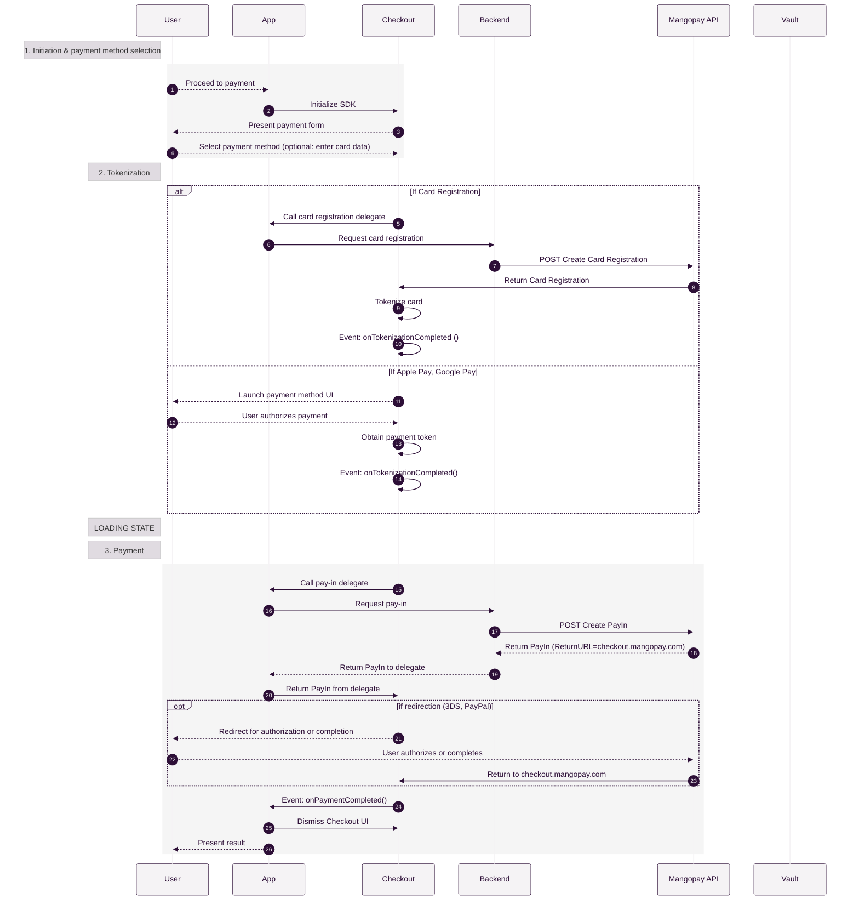

  
{/* Imports */}  

<Note>  
**Note – Beta release**
  
The Checkout SDK is in a beta phase. It has been adopted and integrated by first users, but frequent updates and patches may be made. See the note on Version policy below for how you can best manage this.  
</Note>  

The Mangopay Checkout SDK is a code-light, customizable solution to power the payment page of your website or app. It simplifies your implementation, improves security, and supports a variety of payment methods.   

## Supported payment methods  

Mastercard  

Visa  

CB  

American Express  

Maestro  

Google Pay  

Apple Pay  

PayPal  

<Note>  
**Note – Currency coverage and usage** 
  
Checkout SDK supports all currencies available for all payment methods.  
You must use the same currency for a transaction between your app, Checkout SDK, and calls to the Mangopay API to avoid incompatibility errors.  
</Note>  

## Features  
-Simplified card tokenization in full compliance with PCI-DSS  
-Integrated 3DS handling for secure and seamless payment authentication  
-Customizable design elements to match your branding  
-Localization support for your whole user community  

## How it works  
-The user proceeds to payment on your app or website.  
-You configure and display your chosen payment methods to the user to collect payment information.  
-The user selects the payment method and provide the payment information when required (e.g. card details).  
-The Checkout SDK securely tokenizes the payment data:
For card payments, with the tokenization server via the Mangopay API to generate a `CardId`
For Google Pay and Apple Pay, with the payment method’s API to generate tokenized payment data  
-You create a delegate function that gets called by the SDK to start payment processing.  
-Your server uses the `CardId` or tokenized payment data to create the transaction via the Mangopay API (pay-in, preauthorization, deposit preauthorization, or card validation).  
-Your delegate function returns the outcome of the transaction.  
-If required, the SDK handles additional redirect actions: 3DS authorization or validation via payment method interface (e.g. PayPal).  
-You present the payment result to the user.  

## Flow diagram



## Resources  

### Integration guidesTW an element has not been migrated  

### Changelog  

The GitHub repositories contain changelogs of updates:  
-Changelog – Web  
-Changelog – iOS  
-Changelog – Android  

### CodePen samples for web  

Our team has put together CodePen samples that you can experiment with for the following payment methods:  
-CodePen – Card  

## Version policy  

The Checkout SDK adheres to semantic versioning as the standard for versioning packages.  

Given the SDKs beta status, we anticipate frequent updates and patches to improve stability and introduce new features.  

To ensure a smooth integration experience while avoiding potentially breaking changes, we recommend configuring your dependency manager to automatically install only patch updates.  

For example, when using the web SDK, you can specify the desired patch version in your `package.json` file using the `~` operator:  
```shell Specify patch version
"dependencies": {
  "@mangopay/checkout-sdk": "~1.1.0"
}
```  

This configuration will allow your project to automatically receive patch updates (e.g., `2.0.1`, `2.0.2`, etc.) for bug fixes and minor improvements. However, it will prevent updates to new minor (`2.1.0`) or major (`3.0.0`) versions, which may introduce breaking changes.